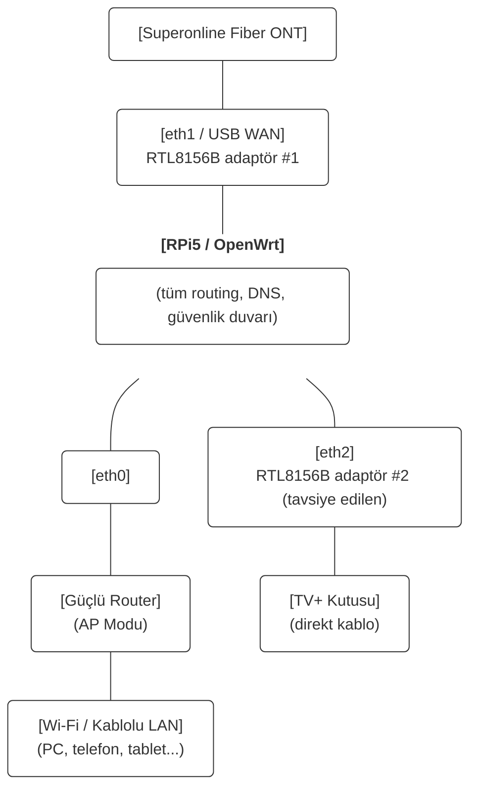
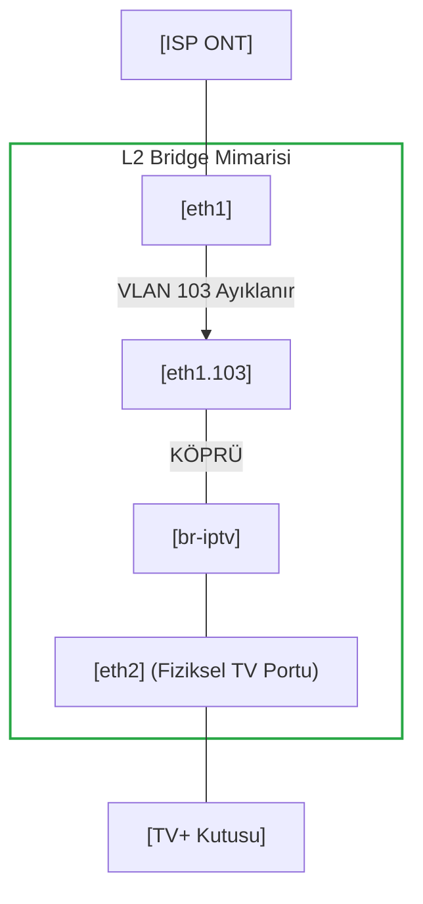
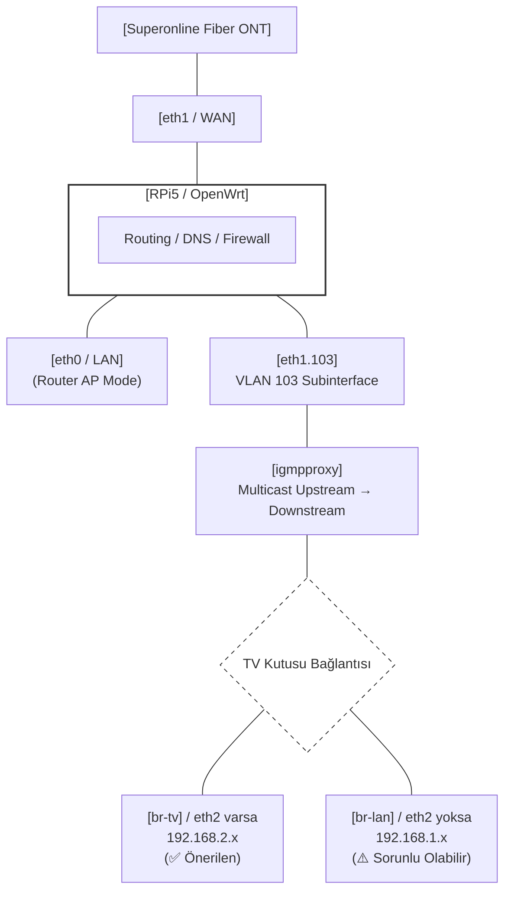

# OpenWrt Ağ Yöneticisi

Raspberry Pi 5 üzerinde çalışan OpenWrt için otomatik yapılandırma betikleri üreten araç.

Superonline TV+ IPTV, DNS zinciri (Split-DNS), DPI Bypass (Zapret), Tailscale ve donanıma özel optimizasyonları güvenilir biçimde kurmak ve kaldırmak için tasarlanmıştır.

---

## Ağ Topolojisi



### Neden Harici Router AP Modunda?

Raspberry Pi 5'in dahili Wi-Fi'si 2.4 GHz / 5 GHz destekler, ancak ev kullanımı için yeterli kapsama alanı ve hız sağlamaz. Bu yapıda:

- **RPi5 → eth0** kablo ile harici router'a (TP-Link, ASUS vb.) bağlıdır
- Harici router **AP (Access Point) modunda** çalışır — DHCP/NAT kapalı, sadece Wi-Fi yayını yapar
- Tüm DHCP, DNS, güvenlik duvarı, Zapret, Tailscale RPi5 üzerinde çalışır
- Cihazlar Wi-Fi'ye bağlandığında IP'yi RPi5'ten alır (`192.168.1.x`)

Bu yaklaşımın avantajları:
- Güçlü Wi-Fi anteni + RPi5'in esnek yazılım yığını bir arada
- Çift NAT yok (harici router NAT yapmıyor)
- AdGuard, Zapret, Tailscale tüm Wi-Fi cihazlarını kapsıyor
- RPi5 güncellenirken/yeniden başlarken tüm ağ etkiliyor — harici router durumu yok

---

## Donanım ve Ortam

| Bileşen | Detay |
|---------|-------|
| **Cihaz** | Raspberry Pi 5 |
| **İşletim Sistemi** | OpenWrt 24.x / 25.x (aarch64, kernel 6.6+) |
| **ISP** | Superonline / Türk Telekom vs. |
| **WAN Adaptörü** | USB 3.0 Ethernet — Realtek RTL8156B (`r8152` sürücüsü) |
| **IPTV Adaptörü** | USB 3.0 Ethernet — Realtek RTL8156B (`r8152` sürücüsü) — önerilen |
| **Wi-Fi** | Harici router AP modunda — RPi5 dahili Wi-Fi kullanılmıyor |
| **Kasa** | Argon ONE V3 — opsiyonel, fan kontrol desteği |

### Port Haritası

| Port | Arayüz | Kullanım |
|------|--------|----------|
| Dahili RJ45 | `eth0` | LAN → Harici router (AP modu) |
| USB Adaptör #1 | `eth1` | WAN — ISP fiber ONT |
| USB Adaptör #2 | `eth2` | TV+ kutusu — **önerilen** |

---

## USB Ethernet RTL8156B — Boot Asılı Kalma Sorunu

Realtek RTL8152/8153/8156/8156B/8157 yongalı adaptörler OpenWrt'te yeniden başlatma sonrasında uykuya dalabilir: arayüz kernel'e kayıtlıdır ama paket gönderemez.

**Çözüm:** `usb-lan-fix` init.d servisi (START=99) boot tamamlanınca tüm r8152 ailesini `/sys/class/net` üzerinden otomatik bulup down→up döngüsüyle uyandırır. Sabit arayüz adı gerektirmez — eth1 ve eth2 her ikisini de yakalar.

WAN kurulumu bu servisi kurar. TV+ kurulumu üzerine yazar (idempotent).

---

## TV+ IPTV Mimarisi
Bu araç, donanımınıza bağlı olarak iki farklı IPTV mimarisi sunar.

### 1. L2 Bridge (Katman 2 Köprü) Modu (ÖNERİLEN VE KARARLI ÇÖZÜM)
Eğer TV kutunuz için ayırdığınız fiziksel bir portunuz (örn: eth2) varsa, araç otomatik olarak bu mimariyi kurar. OpenWrt aradan tamamen çekilir ve ISP'den gelen VLAN (örn: 103) sinyalini yazılımsal olarak eth2 portuna "köprüler".



**Neden L2 Bridge Kullanmalısınız?**

- Sıfır Donma: Routing, Firewall, IGMP Proxy veya Linux Kernel sınırlarına takılmaz. Yayın asla kesilmez.

- MAC Klonlamaya ya Option Verilerini Girmeye Gerek Yok: TV kutusu direkt ISP santraliyle kendi orijinal donanım MAC adresi üzerinden konuşur.

- Tam İzolasyon: Ev ağınız devasa Multicast video trafiğinden %100 izole edilir.

### 2. IGMP Proxy Modu (Yedek Yöntem)
Eğer TV kutusunu takabileceğiniz ayrı bir Ethernet portunuz yoksa ve cihazı mecburen ev ağına (LAN) bağlamak zorundaysanız bu mod kullanılır. igmpproxy yazılımı ve özel güvenlik duvarı (Firewall) kuralları ile Multicast yayınları LAN içine aktarılır.

⚠️ Dikkat: Proxy modu, ISP'nin IGMP Yoklama (Query) sunucularındaki IP bloğu asimetrileri nedeniyle kararsız çalışabilir ([Bkz: Bilinen Hatalar](#iptv-hatalari)).




#### <a id="iptv-hatalari"></a>⚠️ Bilinen Hatalar ve Çözümler
1. TV+ Yayınının 2-3 Dakika Sonra Kesilmesi / Donması

    - Bu sorun yalnızca IGMP Proxy modunda kurulduğunda yaşanabilir.

    **Sebep:** ISP'nin santrali (OLT) kanalı açtığınızda yayını gönderir ancak yaklaşık ~125 saniyede bir "Hala izliyor musun?" diye bir IGMP Query (Yoklama) paketi yollar. Sorun şudur ki; Superonline bazen bu sorguyu sizin IPTV IP bloğunuzdan tamamen farklı, alakasız bir IP adresinden gönderir.
    Linux çekirdeği güvenlik sebebiyle alt ağında olmayan bu paketi "sahte" sanıp düşürür. Router'ınız cevap veremediği için santral izlemediğinizi sanıp 3. dakikada yayını kökünden keser.

    **Çözümler:**

    - Kesin Çözüm (Tavsiye Edilen): 2. USB çevirici adaptörü (USB 3.0 Ethernet — Realtek RTL8156B) alın ve main.py üzerinden TV+ modülünü tekrar kurun ve mimari olarak L2 Bridge modunu seçin. Bu yöntem Linux çekirdeğini aradan çıkardığı için donma imkansız hale gelir.

    - Geçici Çözüm (Timeshift Hilesi): TV kumandanızdan yayını canlı izlemek yerine 1-2 saniye geriye sarın. Geriye sardığınızda yayın Multicast (UDP) formundan çıkıp VOD Unicast (TCP) formuna döner. Unicast paketler çift yönlü ve oturumlu olduğu için IGMP sorgularına ihtiyaç duymaz, yayın asla kesilmez.

---

## Modüller

| # | Modül | Açıklama |
|---|-------|----------|
| 1 | **WAN (PPPoE + IPv6)** | İnternet bağlantısı, USB r8152 boot fix. Diğer tüm modüller bunu gerektirir. |
| 2 | **TV+ IPTV** | VLAN 103, igmpproxy, statik rotalar, dinamik altnet. eth2 varsa TV izole subnet. |
| 3 | **DNS Zinciri** | AdGuard Home (53) → HTTPS-DNS-Proxy → DoH. dnsmasq DHCP-only. |
| 4 | **Zapret** | nfqws tabanlı DPI bypass. Flow offloading otomatik kapatılır. |
| 5 | **Tailscale VPN** | Subnet router, Exit node, WoL. |
| 6 | **Komple Kurulum** | WAN + TV+ + DNS + Zapret + Tailscale tek seferde. |
| 7 | **Disk Genişletme** | SD kart/SSD root bölümünü tam kapasiteye genişletir (2 reboot). |
| 8 | **Argon ONE V3 Fan** | LuCI fan hız kontrolü. Sadece RPi5 + Argon V3. |
| 9 | **IPv6 Kapat / Aç** | odhcp6c SOLICIT spam'i kernel düzeyinde engellenir. |

---

## Önerilen Kurulum Sırası

```
1. WAN (PPPoE + IPv6)   ← İNTERNET BAĞLANTISI — DİĞER HER ŞEY BUNA BAĞLI
                          Test: ping 8.8.8.8 çalışıyor mu?
                          Harici router AP modunda mı? LAN IP 192.168.1.x'ten alınıyor mu?
2. TV+ IPTV             → eth2 sorusu: RTL8156B adaptör takılıysa "eth2" gir
                          eth2 yoksa boş bırak (arada kısa donma yaşanabilir)
                          Test: TV açılıyor mu? 5+ dakika donmadan izleniyor mu?
3. DNS Zinciri          → Test: AdGuard paneli açılıyor mu? Cihazlar görünüyor mu?
4. Zapret               → Test: Engelli sitelere erişim var mı?
5. Tailscale VPN        (opsiyonel, uzaktan erişim)
7. Disk Genişletme      (opsiyonel, reboot gerektirir — paket indirir, WAN sonrası yapın)
8. Argon Fan            (Argon ONE V3 kasanız varsa — paket indirir, WAN sonrası yapın)
```

> **Önemli:** 1. adım (WAN) tamamlanmadan diğer kurulumlar başarısız olur —
> paketler internet üzerinden indirilir.

Her adımdan sonra sorun çıkarsa `uninstall_*.sh` ile geri alabilirsin.

---

## Kullanım

**Gereksinim:** `python3`

```bash
python3 main.py
```

### OpenWrt'e Yükleme (SSH)

```bash
cat kurulum_dosyalari/setup_wan.sh | ssh root@192.168.1.1 \
  "cat > /tmp/s.sh && chmod +x /tmp/s.sh && /tmp/s.sh"
```


---

## RPi5 Dışındaki Cihazlarda Kullanım

Bu proje Raspberry Pi 5 için geliştirildi, ancak çoğu modül **herhangi bir OpenWrt cihazında** çalışır.

### Modül Uyumluluk Tablosu

| Modül | RPi5 | Diğer OpenWrt |
|-------|------|---------------|
| WAN (PPPoE + IPv6) | ✅ | ✅ |
| TV+ IPTV | ✅ | ✅ |
| DNS Zinciri | ✅ | ✅ |
| Zapret | ✅ | ✅ |
| Tailscale VPN | ✅ | ✅ |
| IPv6 Kapat/Aç | ✅ | ✅ |
| USB r8152 Boot Fix | ✅ | Sadece r8152 adaptör varsa |
| Disk Genişletme | ✅ | ❌ RPi5'e özel |
| Argon ONE V3 Fan | ✅ | ❌ RPi5 + Argon V3'e özel |

### Port Adlandırması

En kritik fark port adlandırmasıdır. Modern OpenWrt'te DSA (Distributed Switch Architecture) kullanan cihazlarda portlar farklı adlanır:

| Cihaz tipi | WAN portu | LAN portu örneği |
|------------|-----------|-----------------|
| RPi5 + USB adaptör | `eth1` | `eth0` |
| TP-Link / GL.iNet (DSA) | `eth1` veya `wan` | `lan1`, `lan2`... |
| Eski tarz (swconfig) | `eth0.2` | `eth0.1` |
| x86 / PC | `eth0`, `enp3s0`... | `eth1`... |

CLI'da WAN ve LAN port adlarını soran adımları cihazınızın gerçek arayüz adlarıyla doldurmanız yeterli. Arayüz adlarını görmek için:

```sh
ip link show
# veya LuCI → Network → Interfaces → Devices sekmesi
```

### USB Boot Fix Diğer Cihazlarda

USB adaptör kullanmayan cihazlarda (yerleşik Ethernet portlu router'lar) `usb-lan-fix` servisi kurulur ama hiçbir r8152 adaptör bulamaz ve sessizce atlar. Zarar vermez.

### Disk Genişletme ve Fan

Bu iki modülü RPi5 dışında çalıştırmayın. Diğer betikler bunlardan bağımsızdır.

### Özet

Superonline abonesi olup OpenWrt kullanan herhangi bir router'da WAN + TV+ + DNS + Zapret kurulumunu yapabilirsiniz. Sadece kurulum sırasında kendi cihazınızın port adlarını girmeniz yeterlidir.

---

#### 1. WAN VLAN ID ve IPTV VLAN ID

Superonline'da PPPoE direkt fiziksel port üzerinden gelir — WAN için VLAN yok.
Türk Telekom ve bazı diğer ISP'lerde hem internet hem IPTV VLAN'lı gelir.

| ISP | WAN VLAN | IPTV VLAN | Not |
|-----|----------|-----------|-----|
| Superonline | — (direkt) | 103 | WAN direkt eth1, IPTV eth1.103 |

CLI WAN kurulumunda `WAN VLAN ID` sorulur:
- Superonline → boş bırakın

Girilen ID'ye göre `eth0.35` gibi 802.1q subinterface otomatik oluşturulur,
PPPoE bu device üzerinden kurulur. IPTV VLAN ID ise TV+ kurulumunda ayrıca sorulur.

#### 2. DHCP Kimlik Bilgileri (MAC, Client ID, Vendor ID)

Bazı ISP'ler IPTV servisini tanımak için orijinal modem/kutunun DHCP kimliğini kontrol eder.

| Parametre | Açıklama | Nerede bulunur |
|-----------|----------|----------------|
| MAC Adresi | Orijinal modem/ONU'nun WAN MAC'i | Wireshark tavsiye edilir |
| Client ID (Option 61) | Genellikle MAC tabanlı hex | Wireshark ile eski modem trafiği yakalanarak |
| Vendor ID (Option 60) | `dslforum.org` yaygındır | Wireshark ile öğrenilir |
| Hostname (Option 12) | Modem hostname'i | Wireshark tavsiye edilir |

Eğer ISP'niz bu bilgileri kontrol etmiyorsa boş bırakabilirsiniz.


## Referanslar

- Argon ONE V3 Fan: [ciwga/luci-app-argononev3-fancontrol](https://github.com/ciwga/luci-app-argononev3-fancontrol)
- Disk Genişletme: [openwrt.org — expand root](https://openwrt.org/docs/guide-user/advanced/expand_root)
- Zapret: [bol-van/zapret](https://github.com/bol-van/zapret), [remittor/zapret-openwrt](https://github.com/remittor/zapret-openwrt)