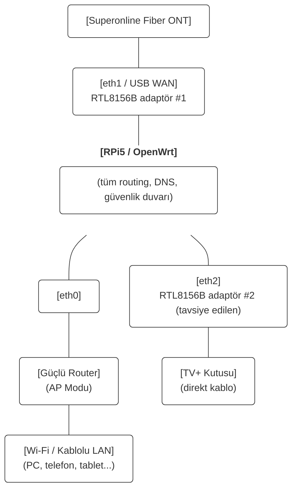
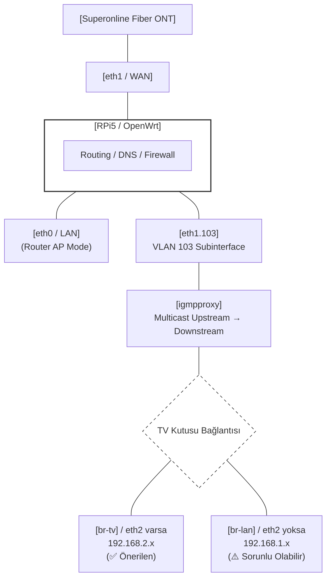
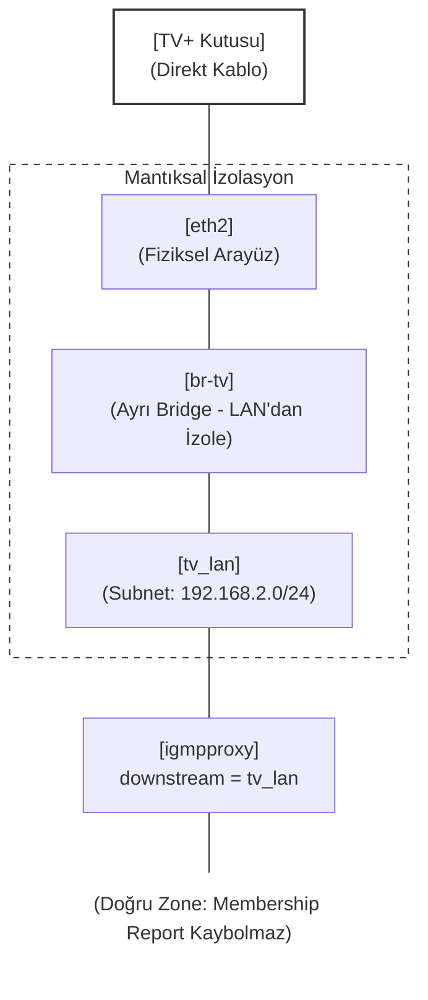

# OpenWrt Ağ Yöneticisi

Raspberry Pi 5 üzerinde çalışan OpenWrt için otomatik yapılandırma betikleri üreten araç.

Superonline TV+ IPTV, DNS zinciri (Split-DNS), DPI Bypass (Zapret), Tailscale ve donanıma özel optimizasyonları güvenilir biçimde kurmak ve kaldırmak için tasarlanmıştır.

---

## Ağ Topolojisi



### Neden Harici Router AP Modunda?

Raspberry Pi 5'in dahili Wi-Fi'si 2.4 GHz / 5 GHz destekler, ancak ev kullanımı için yeterli kapsama alanı ve hız sağlamaz. Bu yapıda:

- **RPi5 → eth0** kablo ile harici router'a (TP-Link, ASUS vb.) bağlıdır
- Harici router **AP (Access Point) modunda** çalışır — DHCP/NAT kapalı, sadece Wi-Fi yayını yapar
- Tüm DHCP, DNS, güvenlik duvarı, Zapret, Tailscale RPi5 üzerinde çalışır
- Cihazlar Wi-Fi'ye bağlandığında IP'yi RPi5'ten alır (`192.168.1.x`)

Bu yaklaşımın avantajları:
- Güçlü Wi-Fi anteni + RPi5'in esnek yazılım yığını bir arada
- Çift NAT yok (harici router NAT yapmıyor)
- AdGuard, Zapret, Tailscale tüm Wi-Fi cihazlarını kapsıyor
- RPi5 güncellenirken/yeniden başlarken tüm ağ etkiliyor — harici router durumu yok

---

## Donanım ve Ortam

| Bileşen | Detay |
|---------|-------|
| **Cihaz** | Raspberry Pi 5 |
| **İşletim Sistemi** | OpenWrt 24.x / 25.x (aarch64, kernel 6.6+) |
| **ISP** | Superonline / Türk Telekom vs. |
| **WAN Adaptörü** | USB 3.0 Ethernet — Realtek RTL8156B (`r8152` sürücüsü) |
| **IPTV Adaptörü** | USB 3.0 Ethernet — Realtek RTL8156B (`r8152` sürücüsü) — önerilen |
| **Wi-Fi** | Harici router AP modunda — RPi5 dahili Wi-Fi kullanılmıyor |
| **Kasa** | Argon ONE V3 — opsiyonel, fan kontrol desteği |

### Port Haritası

| Port | Arayüz | Kullanım |
|------|--------|----------|
| Dahili RJ45 | `eth0` | LAN → Harici router (AP modu) |
| USB Adaptör #1 | `eth1` | WAN — ISP fiber ONT |
| USB Adaptör #2 | `eth2` | TV+ kutusu — **önerilen** |

---

## USB Ethernet RTL8156B — Boot Asılı Kalma Sorunu

Realtek RTL8152/8153/8156/8156B/8157 yongalı adaptörler OpenWrt'te yeniden başlatma sonrasında uykuya dalabilir: arayüz kernel'e kayıtlıdır ama paket gönderemez.

**Çözüm:** `usb-lan-fix` init.d servisi (START=99) boot tamamlanınca tüm r8152 ailesini `/sys/class/net` üzerinden otomatik bulup down→up döngüsüyle uyandırır. Sabit arayüz adı gerektirmez — eth1 ve eth2 her ikisini de yakalar.

WAN kurulumu bu servisi kurar. TV+ kurulumu üzerine yazar (idempotent).

---

## TV+ IPTV Mimarisi

### IGMP Proxy Modu



### eth2 Olmadan — Neden Donma Olur?

TV kutusu LAN'da (192.168.1.x) olduğunda harici router da aynı `br-lan`'dadır. Sorunlar:

1. **Multicast flood:** IGMP Snooping eksik veya yetersiz çalışırsa IPTV multicastı tüm LAN portlarına (harici router dahil) gider. 4–8 Mbps'lik sürekli multicast trafiği diğer cihazları etkiler.

2. **quickleave=1 tuzağı:** Superonline upstream router ~125 (?) saniyede bir IGMP General Query gönderir. `quickleave=1` ile igmpproxy TV'nin cevabını beklemeden üyeliği siler → stream kesilir → kanal değiştirmek zorunlu kalır.

3. **MDB tutarsızlığı:** RPi5'in tek dahili portu nedeniyle br-lan üzerinde igmpproxy downstream zone'u membership report'ları zaman zaman atlayabilir.

Bu proje `quickleave=0` kullanır. Fakat br-lan tabanlı kurulumda risk tamamen ortadan kalkmaz.

- `eth2` olmadan (TV br-lan'da) kurulumda `quickleave=0` ile risk azalır ancak
br-lan MDB tablosu membership report'ları zaman zaman atlayabileceğinden
eth2 ile izole kurulum önerilir.

### eth2 Varsa — Neden Çalışır?



- Multicast yalnızca `br-tv` segmentine gider, harici router etkilenmez
- igmpproxy `tv_lan` zone'unu downstream olarak görür, Join/Leave mesajlarını doğru yakalar
- Firewall: `tv_lan → wan` ACCEPT (masquerade), `tv_lan → lan` REJECT (TV kutusu LAN'a erişemez)

### Statik Rotalar — Neden Zorunlu?

Superonline DHCP sunucusu Option 121 (classless static routes) göndermez. TV sunucuları (`10.31.0.0/16`, `172.31.128.0/19`, `176.43.0.0/24`) PPPoE varsayılan rotasıyla erişilemez, sadece IPTV VLAN gateway'i (`eth1.103`) üzerinden ulaşılabilir.

Hotplug betiği (`99-tvplus-calc`) her `ifup`'ta:
- IPTV gateway'ini DHCP'den öğrenir (Option 3 veya hesaplar)
- IPTV sunucu bloklarını bu gateway üzerinden route eder
- `176.235.7.0/24` (Superonline NTP) istisna rotasını ekler — TV kutusunun saat senkronizasyonu için kritik

---

## Modüller

| # | Modül | Açıklama |
|---|-------|----------|
| 1 | **WAN (PPPoE + IPv6)** | İnternet bağlantısı, USB r8152 boot fix. Diğer tüm modüller bunu gerektirir. |
| 2 | **TV+ IPTV** | VLAN 103, igmpproxy, statik rotalar, dinamik altnet. eth2 varsa TV izole subnet. |
| 3 | **DNS Zinciri** | AdGuard Home (53) → HTTPS-DNS-Proxy → DoH. dnsmasq DHCP-only. |
| 4 | **Zapret** | nfqws tabanlı DPI bypass. Flow offloading otomatik kapatılır. |
| 5 | **Tailscale VPN** | Subnet router, Exit node, WoL. |
| 6 | **Komple Kurulum** | WAN + TV+ + DNS + Zapret + Tailscale tek seferde. |
| 7 | **Disk Genişletme** | SD kart/SSD root bölümünü tam kapasiteye genişletir (2 reboot). |
| 8 | **Argon ONE V3 Fan** | LuCI fan hız kontrolü. Sadece RPi5 + Argon V3. |
| 9 | **IPv6 Kapat / Aç** | odhcp6c SOLICIT spam'i kernel düzeyinde engellenir. |

---

## Önerilen Kurulum Sırası

```
1. WAN (PPPoE + IPv6)   ← İNTERNET BAĞLANTISI — DİĞER HER ŞEY BUNA BAĞLI
                          Test: ping 8.8.8.8 çalışıyor mu?
                          Harici router AP modunda mı? LAN IP 192.168.1.x'ten alınıyor mu?
2. TV+ IPTV             → eth2 sorusu: RTL8156B adaptör takılıysa "eth2" gir
                          eth2 yoksa boş bırak (arada kısa donma yaşanabilir)
                          Test: TV açılıyor mu? 5+ dakika donmadan izleniyor mu?
3. DNS Zinciri          → Test: AdGuard paneli açılıyor mu? Cihazlar görünüyor mu?
4. Zapret               → Test: Engelli sitelere erişim var mı?
5. Tailscale VPN        (opsiyonel, uzaktan erişim)
7. Disk Genişletme      (opsiyonel, reboot gerektirir — paket indirir, WAN sonrası yapın)
8. Argon Fan            (Argon ONE V3 kasanız varsa — paket indirir, WAN sonrası yapın)
```

> **Önemli:** 1. adım (WAN) tamamlanmadan diğer kurulumlar başarısız olur —
> paketler internet üzerinden indirilir.

Her adımdan sonra sorun çıkarsa `uninstall_*.sh` ile geri alabilirsin.

---

## Güvenlik

### Tailscale Güvenlik Notları

Tailscale zone firewall'ı `forward=REJECT` olarak yapılandırılmıştır. İzinler yalnızca explicit forwarding kurallarıyla verilir:

| Kural | Yön | Açıklama |
|-------|-----|----------|
| `ts_to_lan` | Tailscale → LAN | Uzaktan LAN'a erişim |
| `lan_to_ts` | LAN → Tailscale | LAN'dan Tailscale'e erişim |
| `ts_to_wan` | Tailscale → WAN | Sadece exit node aktifse |

Subnet route ve exit node Tailscale admin panelinden ayrıca onaylanmalıdır.

### Üretilen Betiklerin Güvenliği

Betikler `/tmp/` veya `kurulum_dosyalari/` klasörüne yazılır. OpenWrt'e yüklendikten sonra `/tmp/` içindekiler reboot'ta silinir. `kurulum_dosyalari/` içindekileri elle silmeniz önerilir.

---

## Kullanım

**Gereksinim:** `python3`

```bash
python3 main.py
```

### OpenWrt'e Yükleme (SSH)

```bash
cat kurulum_dosyalari/setup_wan.sh | ssh root@192.168.1.1 \
  "cat > /tmp/s.sh && chmod +x /tmp/s.sh && /tmp/s.sh"
```

---

## Dosya Yapısı

```
├── main.py                # CLI arayüzü
├── manager.py             # Konfigürasyon yönetimi ve betik üretimi
├── compat.py              # Paket yöneticisi uyumluluğu + USB r8152 boot fix servisi
├── templates_wan.py       # PPPoE, IPv6, USB boot fix
├── templates_tvplus.py    # TV+ IPTV (igmpproxy, rotalar, eth2 izolasyon)
├── templates_dns.py       # AdGuard + DoH + Split-DNS
├── templates_zapret.py    # DPI bypass (nfqws)
├── templates_tailscale.py # Tailscale VPN
├── templates_ipv6.py      # IPv6 aç/kapat
├── templates_disk.py      # Disk genişletme + Argon fan
├── utils.py               # Yardımcı fonksiyonlar
└── README.md
```

---

## RPi5 Dışındaki Cihazlarda Kullanım

Bu proje Raspberry Pi 5 için geliştirildi, ancak çoğu modül **herhangi bir OpenWrt cihazında** çalışır.

### Modül Uyumluluk Tablosu

| Modül | RPi5 | Diğer OpenWrt |
|-------|------|---------------|
| WAN (PPPoE + IPv6) | ✅ | ✅ |
| TV+ IPTV | ✅ | ✅ |
| DNS Zinciri | ✅ | ✅ |
| Zapret | ✅ | ✅ |
| Tailscale VPN | ✅ | ✅ |
| IPv6 Kapat/Aç | ✅ | ✅ |
| USB r8152 Boot Fix | ✅ | Sadece r8152 adaptör varsa |
| Disk Genişletme | ✅ | ❌ RPi5'e özel |
| Argon ONE V3 Fan | ✅ | ❌ RPi5 + Argon V3'e özel |

### Port Adlandırması

En kritik fark port adlandırmasıdır. Modern OpenWrt'te DSA (Distributed Switch Architecture) kullanan cihazlarda portlar farklı adlanır:

| Cihaz tipi | WAN portu | LAN portu örneği |
|------------|-----------|-----------------|
| RPi5 + USB adaptör | `eth1` | `eth0` |
| TP-Link / GL.iNet (DSA) | `eth1` veya `wan` | `lan1`, `lan2`... |
| Eski tarz (swconfig) | `eth0.2` | `eth0.1` |
| x86 / PC | `eth0`, `enp3s0`... | `eth1`... |

CLI'da WAN ve LAN port adlarını soran adımları cihazınızın gerçek arayüz adlarıyla doldurmanız yeterli. Arayüz adlarını görmek için:

```sh
ip link show
# veya LuCI → Network → Interfaces → Devices sekmesi
```

### USB Boot Fix Diğer Cihazlarda

USB adaptör kullanmayan cihazlarda (yerleşik Ethernet portlu router'lar) `usb-lan-fix` servisi kurulur ama hiçbir r8152 adaptör bulamaz ve sessizce atlar. Zarar vermez.

### Disk Genişletme ve Fan

Bu iki modülü RPi5 dışında çalıştırmayın. Diğer betikler bunlardan bağımsızdır.

### Özet

Superonline abonesi olup OpenWrt kullanan herhangi bir router'da WAN + TV+ + DNS + Zapret kurulumunu yapabilirsiniz. Sadece kurulum sırasında kendi cihazınızın port adlarını girmeniz yeterlidir.

---

## Superonline Dışı ISP'ler İçin Kullanım

Bu proje Superonline için geliştirildi, ancak altyapı tasarımı standart PPPoE + VLAN + IGMP mimarisine dayanır. Diğer ISP'ler de benzer yapı kullanıyorsa çalışır — ayarlanması gereken birkaç parametre vardır.

### Türkiye'deki Yaygın ISP'ler

| ISP | PPPoE | IPTV VLAN | IGMP | Notlar |
|-----|-------|-----------|------|--------|
| Superonline | ✅ | 103 | v2 | Bu proje için optimize |
| Türk Telekom (TTNET) | ✅ | 35 (yaygın) | v2/v3 | DHCP option'ları farklı |
| TurkNet | ✅ | ISP'ye göre | v2 | |
| Vodafone TR | ✅ | Bölgeye göre | v2 | |
| Millenicom | ✅ | ISP'ye göre | v2 | |

> **Not:** VLAN ID'ler bölgeye ve altyapıya göre değişebilir. Kesin değeri ISP'nizin teknik desteğinden veya eski modem/router'ınızın VLAN ayarlarından öğrenebilirsiniz.

### Hangi Parametreler Değişmeli?

#### 1. WAN VLAN ID ve IPTV VLAN ID

Superonline'da PPPoE direkt fiziksel port üzerinden gelir — WAN için VLAN yok.
Türk Telekom ve bazı diğer ISP'lerde hem internet hem IPTV VLAN'lı gelir.

| ISP | WAN VLAN | IPTV VLAN | Not |
|-----|----------|-----------|-----|
| Superonline | — (direkt) | 103 | WAN direkt eth1, IPTV eth1.103 |
| Türk Telekom | 35 (yaygın) | 55 (yaygın) | WAN eth0.35, IPTV eth0.55 |
| TurkNet | 35 | 55 | Türk Telekom altyapısı |
| Vodafone TR | Bölgeye göre | Bölgeye göre | ISP'den öğrenin |

CLI WAN kurulumunda `WAN VLAN ID` sorulur:
- Superonline → boş bırakın
- Türk Telekom → `35` girin

Girilen ID'ye göre `eth0.35` gibi 802.1q subinterface otomatik oluşturulur,
PPPoE bu device üzerinden kurulur. IPTV VLAN ID ise TV+ kurulumunda ayrıca sorulur.

#### 2. DHCP Kimlik Bilgileri (MAC, Client ID, Vendor ID)

Bazı ISP'ler IPTV servisini tanımak için orijinal modem/kutunun DHCP kimliğini kontrol eder.

| Parametre | Açıklama | Nerede bulunur |
|-----------|----------|----------------|
| MAC Adresi | Orijinal modem/ONU'nun WAN MAC'i | Wireshark tavsiye edilir |
| Client ID (Option 61) | Genellikle MAC tabanlı hex | Wireshark ile eski modem trafiği yakalanarak |
| Vendor ID (Option 60) | `dslforum.org` yaygındır | Wireshark ile öğrenilir |
| Hostname (Option 12) | Modem hostname'i | Wireshark tavsiye edilir |

Eğer ISP'niz bu bilgileri kontrol etmiyorsa boş bırakabilirsiniz.

#### 3. IGMP Proxy Altnet Listesi

Her ISP'nin IPTV sunucuları farklı IP bloklarında bulunur. Superonline için:

```
225.0.0.0/8   — multicast stream
233.0.0.0/8   — multicast stream
10.31.0.0/16  — portal, EPG sunucuları
172.31.128.0/19 — stream sunucuları
176.43.0.0/24 — portal
176.235.7.0/24 — NTP
```

Diğer ISP'ler için doğru altnet listesini bulmak için eski modem/router'da tcpdump ile IPTV trafiğini yakalayabilirsiniz.

Görünen IP bloklarını `igmpproxy` altnet listesine ekleyin.

#### 4. Statik Rotalar

`99-tvplus-calc` hotplug betiği `10.31.0.0/16`, `172.31.128.0/19`, `176.43.0.0/24`, `176.235.7.0/24` rotalarını sabit olarak ekler. Bunlar Superonline'a özgü. Başka bir ISP kullanıyorsanız `templates_tvplus.py` içindeki hotplug bölümündeki rota listesini kendi ISP bloklarınıza göre düzenlemeniz gerekir.

### Genel Yaklaşım: Yeni ISP için Nasıl Uyarlanır?

1. **Eski modem/router'ı bir kenara bırakmadan önce** Wireshark veya tcpdump ile IPTV trafiğini yakalayın — VLAN ID, DHCP option'ları ve hedef IP blokları bu şekilde öğrenilir.

2. `python3 main.py` → TV+ modülünü seçin → kendi ISP parametrelerinizi girin.

3. Kurulum sonrası `logread | grep IPTV_LOG` ile hotplug'ın doğru gateway'i bulup rota eklediğini doğrulayın.

4. Altnet listesi yetersizse `/etc/hotplug.d/iface/99-tvplus-calc` içine ISP'nize özgü blokları ekleyin.

---

## Referanslar

- Argon ONE V3 Fan: [ciwga/luci-app-argononev3-fancontrol](https://github.com/ciwga/luci-app-argononev3-fancontrol)
- Disk Genişletme: [openwrt.org — expand root](https://openwrt.org/docs/guide-user/advanced/expand_root)
- Zapret: [bol-van/zapret](https://github.com/bol-van/zapret), [remittor/zapret-openwrt](https://github.com/remittor/zapret-openwrt)